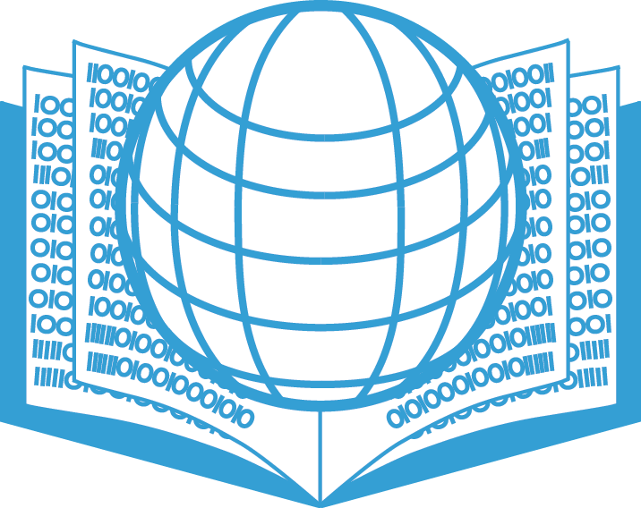
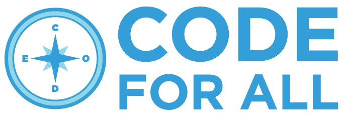
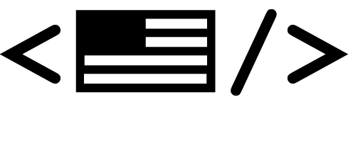

# The Code for All International Toolkit

 

## Introduction

This toolkit serves to document the Code for America fellowship program within the U.S. with the hope that it will serve as a helpful reference to support our partners in other countries in the formation of their own programs. The following is a living document serving anyone with the desire to replicate or remix parts of our program for their own purposes. Produced (originally) in collaboration by Code for All’s Lynn Fine and Alexander Tran, Fellowship Program Manager, with content from the entire civic tech community.

 

 

